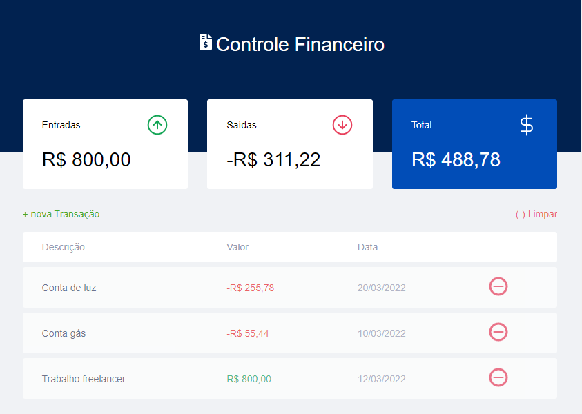

# Sistema de controle financeiro
 

  

 

## Tecnologias

Esse projeto foi desenvolvido com as seguintes tecnologias:  

## Projeto 

Mini sistema financeiro responsivo adpatável a dispositivos móveis desenvolvido com javascript html e css com as funcionalidades de adicionar transaçoes, deletar transações e calculo total dos valores.

## Licença

Esse projeto está sob a licença MIT. Veja o arquivo [LICENSE](https://github.com/WyllianSilveira/Sistema-de-controle-financeiro/blob/main/LICENSE) para mais detalhes.

## Link do projeto

<a href="https://wylliansilveira.github.io/Sistema-de-controle-financeiro/">👉 Clique Aqui</a>

